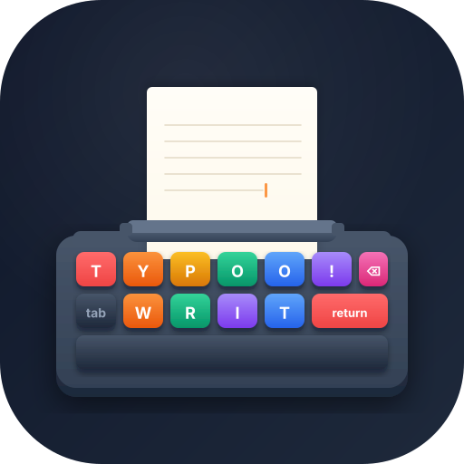

<p align="center">
  
</p>

<h1 align="center">📖 Typoo — Suite Profesional de Escritura de Novelas</h1>

<p align="center">
  <em>Suite de escritura para proyectos literarios, construida con Python 3 y PySide6.</em><br>
  ✍️ Editor literario · 🗂️ Dossier del proyecto · 🧵 Tramas · 🤖 Asistente de IA opcional
</p>

<p align="center">
  <strong>Autoría:</strong> NULLUSNULL &nbsp;·&nbsp;
  <strong>Licencia:</strong> MIT &nbsp;·&nbsp;
  <strong>Versión:</strong> 1.3.0
</p>

---

## ✨ Funcionalidades

| Área | Descripción |
|------|-------------|
| 🗂️ Dossier del proyecto | Estructura tipo dossier: **Manuscrito** (capítulos→escenas), **Personajes**, **Ubicaciones** y **Notas e investigación**. El orden de lectura es el del Manuscrito de arriba abajo |
| 📁 Gestor de proyectos | Ventana de inicio y menú *Archivo → Gestor de proyectos* (`Ctrl+Shift+O`): lista todos tus proyectos conocidos y permite **abrir**, **crear**, **añadir** una carpeta existente o **eliminar** un proyecto (con confirmación escribiendo su nombre) |
| ✍️ Editor literario | Tipografía con serifas, columna de lectura centrada, interlineado amplio, resaltado de sintaxis discreto y zoom con Ctrl+rueda |
| 🔤 Tipografías empaquetadas | Fuentes literarias incluidas (Lora, EB Garamond, Literata, Crimson Pro, Spectral, Bitter, Playfair Display, Inter), seleccionables desde la barra de formato |
| 🪟 Múltiples áreas de trabajo | Hasta 3 editores simultáneos con splitters redimensionables |
| 📝 Panel de detalles | Metadatos propios de cada tipo de elemento según la pestaña con foco; las escenas se vinculan a personajes, ubicaciones y tramas con selectores explícitos |
| 🧵 Visor de tramas | Rejilla *story grid* (escenas × entidad) coloreada por trama: muestra qué escenas desarrollan cada **trama**, en qué escenas aparece cada **personaje** y dónde ocurre cada **ubicación** |
| 🎨 Barra de formato | Iconos vectoriales nítidos para negrita/cursiva/subrayado/tachado, sub/superíndice, citas, listas con sangría multinivel (Tab/Mayús+Tab) y separador de escena; más caracteres especiales (guiones, comillas españolas/inglesas, símbolos) |
| 🤖 Asistente de IA (opcional) | Reescritura, corrección, sinopsis y fichas, guardián de coherencia, tormenta de ideas y chat con contexto (RAG). **Desactivado por defecto** |
| 🔍 Búsqueda | Simple, con regex y búsqueda en todo el proyecto |
| 📤 Exportación | Word (.docx), PDF y texto plano (.txt) |
| 🌗 Temas | Oscuro (defecto) y claro tipo macOS, intercambiables con Ctrl+Shift+T |
| 💾 Autoguardado | Configurable, con copias de seguridad ZIP automáticas |
| 🗄️ Respaldos | Ruta personalizada e intervalo configurable (5 min – 1 h) |
| 🧘 Modo concentración | Deja solo el texto centrado: oculta menú, paneles y barra de edición. `F12` entra, `Esc` sale |
| 🪟 Barra de título propia (Linux) | En Linux la ventana prescinde de la barra de título del sistema: el nombre de la app y los botones de minimizar/maximizar/cerrar viven en la barra superior; se arrastra desde ahí y se maximiza con doble clic |

---

## 🧩 Requisitos

- **Python 3.9+**
- **PySide6** (Qt for Python 6)
- Sistema operativo: Windows 10+, Ubuntu 20.04+, macOS 12+

---

## 🚀 Instalación rápida

```bash
# 1. Clonar o descargar el repositorio
git clone https://github.com/NULLUSNULL/Typoo.git
cd Typoo

# 2. Crear entorno virtual (recomendado)
python -m venv .venv

# Windows
.venv\Scripts\activate

# Linux / macOS
source .venv/bin/activate

# 3. Instalar dependencias
pip install -r requirements.txt

# 4. Ejecutar
python main.py
```

---

## ⌨️ Atajos de teclado principales

| Atajo | Acción |
|-------|--------|
| `Ctrl+Shift+O` | Gestor de proyectos |
| `Ctrl+Shift+N` | Nuevo proyecto |
| `Ctrl+O` | Abrir proyecto |
| `Ctrl+S` | Guardar documento activo |
| `Ctrl+Shift+S` | Guardar todos |
| `Ctrl+F` | Buscar en documento |
| `Ctrl+H` | Buscar y reemplazar |
| `Ctrl+B` / `Ctrl+I` / `Ctrl+U` | Negrita / Cursiva / Subrayado |
| `Ctrl+1..4` | Mostrar/ocultar paneles (explorador, áreas, detalles) |
| `Ctrl+5` | Mostrar/ocultar el visor de tramas |
| `Ctrl+6` | Mostrar/ocultar el asistente de IA |
| `Ctrl+Shift+T` | Cambiar tema claro/oscuro |
| `F11` | Pantalla completa |
| `F12` | Modo concentración (`Esc` para salir) |
| `Ctrl+,` | Preferencias |
| `Ctrl+Q` | Salir |

---

## 📁 Gestor de proyectos

Al abrir Typoo aparece el **gestor de proyectos**, también accesible en todo momento
desde *Archivo → Gestor de proyectos* (`Ctrl+Shift+O`). Desde él puedes:

- **Abrir** cualquier proyecto conocido (doble clic o botón *Abrir*).
- **Crear** un proyecto nuevo.
- **Añadir** una carpeta de proyecto existente que no esté en la lista.
- **Eliminar** un proyecto del disco de forma permanente; por seguridad, hay que
  **escribir su nombre exacto** para confirmar.

Los proyectos que ya no se encuentran en disco se marcan como *no encontrado* y no
pueden abrirse, pero sí quitarse de la lista.

---

## 🤖 Asistente de IA (opcional)

La integración con IA es **opcional y está desactivada por defecto**. Sin habilitarla,
Typoo funciona igual y no añade dependencias obligatorias. Se activa en
*Herramientas → Preferencias → IA*.

- **Proveedores**:
  - ☁️ **Nube**: OpenAI, Anthropic, NVIDIA, Groq, Mistral.
  - 💻 **Local**: Ollama y LM Studio.
  - 📦 **Embebido**: modelos GGUF descargables que se ejecutan en tu equipo
    (dependencia opcional `llama-cpp-python`).
- **Funciones** (visibles solo tras habilitar):
  - **Reescribir / corregir** la selección desde el menú contextual del editor
    (pulir, condensar, expandir, cambiar de registro, «mostrar no contar»,
    naturalizar diálogo, corrección ortográfica y gramatical).
  - **Sinopsis** automática de escena/capítulo y **fichas** de personajes/ubicaciones.
  - **Guardián de coherencia** a nivel de personaje y de capítulo.
  - **Tormenta de ideas** guiada para continuar la historia.
  - **Enviar a Notas**: la revisión de coherencia y la tormenta de ideas pueden
    guardarse como una nota nueva, con un **título generado automáticamente**.
  - **Asistente (chat con contexto / RAG)**: panel lateral (`Ctrl+6`) que responde
    sobre el manuscrito citando sus fuentes.

> Con proveedores en la nube, el texto que envíes saldrá de tu equipo hacia un
> tercero. Los modos local y embebido funcionan sin conexión.

---

## 🪟 Áreas de trabajo

Typoo dispone de hasta **3 áreas de trabajo** independientes, cada una con sus propias pestañas de documentos abiertos.

- **Abrir en área**: clic derecho sobre un documento en el explorador → *Abrir en área* → selecciona Área 1, 2 o 3.
- **Mover entre áreas**: clic derecho sobre una pestaña abierta → *Mover a Área X*.
- Las áreas se pueden mostrar u ocultar desde el menú *Ver*.

---

## 🗂️ Dossier del proyecto

El árbol del proyecto sigue una estructura de **dossier** con cuatro secciones fijas:

```
- Manuscrito
  - Capítulo 1
    - Escena 1.1
    - Escena 1.2
  - Capítulo 2
    - Escena 2.1
- Personajes
  - Protagonista
  - Antagonista
- Ubicaciones
  - El faro
- Notas e investigación
```

- Los **capítulos** son carpetas (sin texto propio) y las **escenas** son los documentos que viven dentro de ellos.
- El **orden de lectura** de la novela es el del árbol del *Manuscrito* leído de arriba abajo.
- El menú contextual del explorador ofrece la creación pertinente según el contenedor (capítulos en *Manuscrito*, escenas dentro de un capítulo, etc.). Al crear una escena desde *Proyecto → Nueva escena* se pregunta a qué capítulo añadirla.
- **Reordenación por arrastre**: se pueden reordenar y reorganizar elementos dentro de su misma sección (reordenar capítulos, mover escenas entre capítulos, ordenar personajes/ubicaciones…). No se permite mezclar secciones. El nuevo orden se guarda y actualiza el orden de lectura.

---

## 🧵 Tramas y relaciones

Cada **trama** (hilo argumental) tiene un nombre y un color, y se gestiona desde el
**visor de tramas** (menú *Ver → Visor de tramas*, `Ctrl+5`), una banda inferior con una
rejilla *story grid*:

- **Columnas**: las escenas en orden de lectura del manuscrito.
- **Filas**: tramas, personajes o ubicaciones (selector *Ver por:*), cada una con su color.
- Una celda coloreada indica que esa escena está relacionada con esa entidad.

Las relaciones se alimentan de los **vínculos explícitos** del panel de Detalles de cada
escena (personajes presentes, ubicación, punto de vista y tramas), de modo que el visor
responde a tres consultas:

| Flujo | Significado |
|-------|-------------|
| **Trama → escenas** | Qué escenas desarrollan cada trama (clic en la celda para marcar) |
| **Personaje → escenas** | En qué escenas aparece cada personaje |
| **Ubicación → escenas** | Qué escenas ocurren en cada ubicación |

Las tramas se guardan en `proyecto.json` y los vínculos en los metadatos de cada escena.

---

## 💾 Respaldos automáticos

En *Preferencias* (Ctrl+,) → sección **Respaldo automático**:

- **Intervalo**: desactivado, 5 min, 15 min, 30 min, 45 min o 1 hora.
- **Ruta de destino**: carpeta personalizada para guardar los ZIP de respaldo. Si se deja vacía, los respaldos se crean en `.respaldos/` dentro de la carpeta del proyecto.

---

## 📤 Exportación

Requiere dependencias opcionales instaladas:

```bash
pip install python-docx reportlab
```

El diálogo de exportación (menú *Archivo → Exportar*) indica el comando exacto si falta alguna dependencia.

---

## 🌗 Temas visuales

| Tema | Descripción |
|------|-------------|
| **Oscuro** (defecto) | Paleta One Dark. Fondo `#282C34`, texto `#ABB2BF`, acento `#528BFF`. |
| **Claro** | Inspirado en macOS. Fondo `#F5F5F7`, editor blanco, acento `#007AFF`. |

El tema se alterna con `Ctrl+Shift+T` y se recuerda entre sesiones. Los iconos de la
barra de formato se redibujan automáticamente para adaptarse al tema activo.

---

## 🗃️ Estructura del proyecto

```
Typoo/
├── main.py                      # Punto de entrada
├── requirements.txt
├── LICENSE
├── README.md
│
├── core/
│   ├── constantes.py            # Constantes y enumeraciones globales
│   ├── configuracion.py         # Configuración persistente (QSettings)
│   ├── metadatos.py             # Esquema de metadatos por tipo de elemento
│   ├── fuentes.py               # Registro de tipografías empaquetadas y catálogo
│   └── logger.py                # Sistema de logging
│
├── models/
│   ├── documento.py             # ItemProyecto (nodo del árbol)
│   └── proyecto.py              # Proyecto (dossier, tramas, carga/guardado JSON)
│
├── services/
│   ├── gestor_proyectos.py      # CRUD de proyectos y elementos
│   ├── gestor_archivos.py       # Operaciones de sistema de archivos y respaldos
│   ├── autoguardado.py          # Timer de autoguardado (QTimer)
│   └── busqueda.py              # Búsqueda y reemplazo (regex)
│
├── ai/                          # Integración con IA (opcional)
│   ├── proveedores.py           # Abstracción de proveedores (nube/local/embebido)
│   ├── tareas.py                # Construcción de prompts por tarea
│   ├── servicio.py              # Ejecución en segundo plano (QThread, streaming)
│   ├── contexto.py              # Preparación de contexto y truncado
│   ├── modelos.py               # Catálogo de modelos GGUF embebidos
│   └── recuperacion.py          # Recuperación léxica ligera (BM25) para el chat
│
├── editors/
│   ├── resaltador_sintaxis.py   # QSyntaxHighlighter para Markdown (discreto)
│   └── editor_markdown.py       # Editor literario: serifas, columna centrada, formato
│
├── widgets/
│   ├── explorador_proyecto.py   # Árbol lateral del dossier (QTreeWidget)
│   ├── barra_herramientas.py    # Barra de formato con iconos vectoriales
│   ├── iconos_formato.py        # Iconos de la barra dibujados con QPainter (temáticos)
│   ├── panel_pestanas.py        # Contenedor de pestañas con botón × de cierre
│   ├── panel_metadatos.py       # Panel lateral de detalles/metadatos del elemento
│   ├── panel_asistente.py       # Panel de chat del asistente de IA (RAG)
│   ├── selector_multiple.py     # Selector multiselección (personajes, tramas…)
│   ├── panel_tramas.py          # Visor de tramas (rejilla story grid)
│   └── barra_estado.py          # Barra de estado inferior (QStatusBar)
│
├── ui/
│   ├── ventana_principal.py     # Ventana principal (QMainWindow)
│   ├── temas/
│   │   └── gestor_temas.py      # Hojas de estilo QSS claro/oscuro
│   └── dialogos/
│       ├── gestor_proyectos.py  # Gestor de proyectos (inicio y menú)
│       ├── nuevo_proyecto.py    # Diálogo de nuevo proyecto
│       ├── buscar_reemplazar.py # Diálogo buscar/reemplazar
│       ├── exportar.py          # Diálogo de exportación
│       ├── preferencias.py      # Diálogo de preferencias (fuente, respaldo, tema, IA)
│       ├── config_ia_widget.py  # Configuración del asistente de IA
│       ├── resultado_ia.py      # Diálogo de sugerencia de IA en streaming
│       ├── tormenta_ia.py       # Diálogo de tormenta de ideas guiada
│       └── modelos_embebidos.py # Gestor de descarga de modelos GGUF
│
├── exporters/
│   ├── exportador_docx.py       # Exportación a Word (python-docx)
│   ├── exportador_pdf.py        # Exportación a PDF (reportlab)
│   └── exportador_txt.py        # Exportación a texto plano
│
└── assets/
    ├── iconos/                  # Iconos e icono de la aplicación (SVG/ICO/ICNS)
    └── fonts/                   # Tipografías literarias empaquetadas (SIL OFL) + licencias
```

---

## 📦 Formato de proyecto en disco

```
MiNovela/
├── proyecto.json          # Árbol del dossier, metadatos de cada elemento y tramas
├── manuscrito/            # Documentos de las escenas (los capítulos son carpetas del árbol)
│   ├── escena_1_1.md
│   └── escena_1_2.md
├── personajes/
│   └── protagonista.md
├── ubicaciones/
│   └── el_faro.md
├── notas/
└── .respaldos/            # Copias de seguridad ZIP automáticas
```

---

## 🛠️ Empaquetado para distribución

Typoo se empaqueta con [PyInstaller](https://pyinstaller.org). Hay un script por
plataforma; ambos incluyen todos los *assets* (tipografías e iconos) y el
resultado no requiere tener Python instalado.

### Windows → `dist\Typoo.exe`

```bat
build.bat
```

### macOS → `dist/Typoo.app`  ·  Linux → `dist/Typoo`

```bash
chmod +x build.sh      # solo la primera vez
./build.sh
```

El script detecta el sistema: en macOS genera un paquete `Typoo.app` y en Linux
un ejecutable `Typoo`. Para distribuir el `.app` puedes comprimirlo:

```bash
ditto -c -k --keepParent dist/Typoo.app dist/Typoo-mac.zip
```

**Dependencias:** si el intérprete actual ya tiene instaladas las dependencias
(`pip install -r requirements.txt`) y PyInstaller, `build.sh` las usa. Si no,
crea automáticamente un entorno virtual local en `.venv/` e instala ahí lo
necesario. Esto evita el error `externally-managed-environment` (PEP 668) del
Python de Homebrew en macOS sin tocar el Python del sistema; el `.venv` se
reutiliza en compilaciones posteriores.

#### Icono del `.app` (macOS)

El paquete `.app` usa un icono en formato `.icns`. **Ya viene incluido** en
`assets/iconos/typoo-icon.icns`, así que `build.sh` lo usa automáticamente y el
`.app` sale con el icono de Typoo sin pasos adicionales.

Si quieres **regenerarlo o cambiarlo**, en un Mac:

1. Exporta `assets/iconos/typoo-icon.svg` a un PNG cuadrado de **1024×1024**
   (con Vista Previa, Figma, Inkscape…), por ejemplo `typoo-icon-1024.png`.
2. Ejecuta el ayudante incluido (usa las herramientas nativas `sips` e `iconutil`):

   ```bash
   chmod +x assets/iconos/make_icns.sh
   assets/iconos/make_icns.sh ruta/al/typoo-icon-1024.png
   ```

   Esto sobrescribe `assets/iconos/typoo-icon.icns`. Vuelve a ejecutar `./build.sh`.

> **Nota:** cada instalador debe generarse en su propio sistema operativo
> (PyInstaller no compila de forma cruzada): el `.exe` en Windows, el `.app` en
> macOS y el binario de Linux en Linux. En Apple Silicon puedes además crear un
> `.dmg` con `hdiutil create -volname Typoo -srcfolder dist/Typoo.app -ov -format UDZO dist/Typoo.dmg`.

### Manualmente (sin script)

```bash
pip install pyinstaller
# Windows: usa ';' como separador de --add-data
# macOS/Linux: usa ':'
pyinstaller --onefile --windowed --name Typoo \
    --add-data "assets:assets" \
    --distpath dist --workpath build_tmp --specpath build_tmp \
    main.py
```

---

## 📜 Licencia

MIT License — Copyright (c) 2026 NULLUSNULL

Consulta el archivo [LICENSE](LICENSE) para más información.

---

## 🤝 Contribuciones

Las contribuciones son bienvenidas mediante pull requests o issues en el repositorio.
